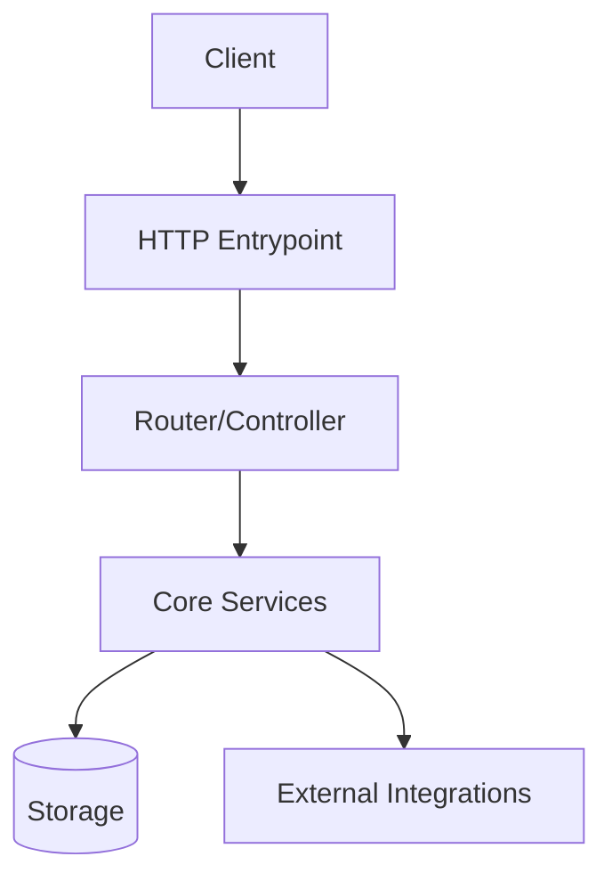
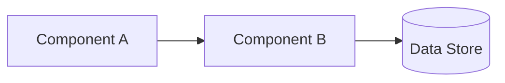
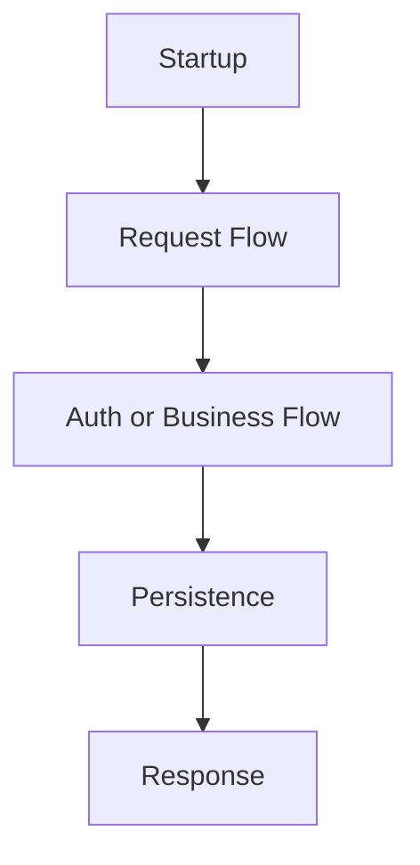

# Doc Templates

## system-overview.md

```markdown
# System Overview

## System Design Diagram



## Purpose
## System Scope
## Tech Stack
## Startup Model
## Major Subsystems
## Data/Storage Overview
## External Integrations
## Key Architectural Patterns
## Risks and Unknowns
```

## components.md

```markdown
# Components

## Component Interaction Diagram



## Component List
## Component Hierarchy
## Responsibilities
## Interfaces and Boundaries
## Dependency Relationships
## Shared Utilities
## Hotspots
```

## runtime-flows.md

```markdown
# Runtime Flows

## Purpose

## Flow Diagram



## Major Flow Categories

- Startup flow
- Request/response flow
- Background job flow
- Event/queue flow
- Scheduled task flow

## Detailed Flow Status

For each category, record:

- Known entrypoints
- Major stages
- Unresolved sections
- Linked future detailed docs
```

## Diagram Rules

- Use Mermaid `flowchart` for system and workflow diagrams by default
- Use Mermaid `sequenceDiagram` only when request/response ordering is clearer than component topology
- Keep diagrams aligned to observed code paths and mark uncertain edges in adjacent text as **Unknown**
- Prefer one high-signal diagram per bootstrap doc section instead of many low-value diagrams

## modules/README.md

```markdown
# Modules Index

| Module | Responsibility | Status |
|--------|---------------|--------|
| _name_ | _one-line description_ | documented / partial / pending |
```

## features/README.md

```markdown
# Features Index

| Feature | Description | Status |
|---------|------------|--------|
| _name_ | _one-line description_ | traced / partial / not yet traced |
```

## ai-context.md

```markdown
# AI Context

## Project Purpose
## Core Architectural Style
## Critical Invariants
## Important Dependency Boundaries
## High-Risk Change Zones
## Where to Inspect First by Change Type
## Key Terminology
## Trusted Docs and Files
```

## known-gaps.md

```markdown
# Known Gaps

## Missing Traces
## Doc/Code Mismatches
## Unclear Ownership
## Unverified Assumptions
## Recommended Next Investigations
```
